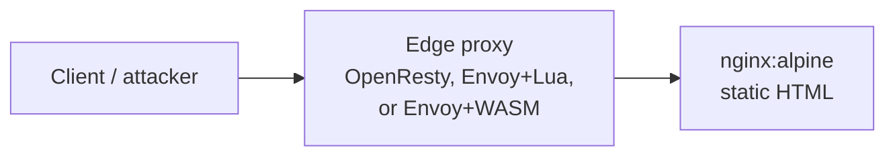

<!-- CONTEXT.md: orientation for humans and AI; explains repo purpose, stack, layout, and where to look for behavior. -->
# Project context (for AI assistants and contributors)

<!-- Intro: why this doc exists — one paragraph to align readers on WADM/honeytokens before diving into files. -->
This repository is a small **web-application-defense / honeypot-style demonstration** (“WADM” in logs). A trivial static “backend” is served through one of several **edge proxies**. Each proxy loads `config.json`, **injects HTML comment honeytokens** into HTML responses (based on path patterns), and **watches incoming traffic** for configured `trigger_keyword` strings. When a keyword appears in query parameters, form bodies, or raw bodies, the proxy logs a warning, may **strip or rewrite** the offending data so the origin never sees the secret, and may **record the client IP** for follow-up alerting logic.

The same `config.json` schema is consumed by the Lua, OpenResty, and Rust (WASM) implementations so you can compare behavior across stacks.

---

## `config.json` (what operators should know)

<!-- JSON cannot contain comments; keep field guidance here so editors stay valid. -->
| Field | Meaning for you |
|--------|------------------|
| `honeytokens.html_comments[]` | Each entry is one injectable “bait” plus optional detection string. |
| `paths` | Where to inject `comment_value` into HTML: use `/*` for every page, or an exact path like `/index.html` (match is against path without query; stacks differ slightly—see READMEs). |
| `comment_value` | HTML comment string embedded before `</body>` (or appended). Treat as **secret** you want leaked only if someone scrapes HTML. |
| `trigger_keyword` | If present, edge checks **requests** for this substring (query/body/path depending on stack). Hit → log + often strip + sometimes IP tracking. Empty/absent → inject-only for that row. |

Edit `config.json` on the host; Compose mounts it read-only into each edge container at the paths listed in `docker-compose.yml`.

---

## High-level architecture

<!-- Diagram + bullets: why read this first — shows traffic shape before opening compose or envoy. -->

1. **Backend** — plain nginx serving `index.html` (the “victim” application surface).
2. **Edge** (pick one compose profile) — terminates HTTP, applies WADM rules, proxies to `backend:80`.
3. **Configuration** — `config.json` at repo root lists `honeytokens.html_comments[]` with `paths`, `comment_value`, and optional `trigger_keyword`.

Docker Compose wires services on a shared `honeypot` bridge network. Only the edge service exposes a host port (`8080`, `8081`, or `8082` depending on profile).

---

## Exact tech stack

<!-- Stack table: why it matters — pins what images and runtimes to expect when reproducing bugs. -->
| Layer | Technology | Version / image (as pinned in repo) |
|--------|------------|--------------------------------------|
| Orchestration | Docker Compose | Compose file v3-style `services` |
| Backend | nginx | `nginx:alpine` |
| OpenResty path | OpenResty (nginx + LuaJIT + `lua-nginx-module`) | `openresty/openresty:latest` |
| Envoy paths | Envoy Proxy | `envoyproxy/envoy:v1.30-latest` |
| Envoy Lua | Built-in Envoy HTTP Lua filter + vendored `json.lua` (rxi) | See `envoy_scripts/json.lua` |
| Envoy WASM | `envoy.filters.http.wasm` + **V8** runtime (`envoy.wasm.runtime.v8`) | Same Envoy image |
| WASM filter | Rust, `cdylib`, **proxy-wasm** SDK | `proxy-wasm = "0.2"`, `serde` / `serde_json`, `log`, edition 2021 |
| WASM build | Rust official image | `rust:latest`, target `wasm32-unknown-unknown` |
| Shell glue | POSIX `sh`, `sed` | `envoy-wasm/entrypoint.sh` embeds JSON into YAML |

**Host ports (defaults in `docker-compose.yml`):** OpenResty `8080`, Envoy+Lua `8081`, Envoy+WASM `8082`.

---

## Root-level folders and files

<!-- Map: why each top-level path exists — quick navigation for changes. -->
| Path | Role |
|------|------|
| `backend/` | Static site + nginx config for the origin container (`index.html`, logging-focused `nginx.conf`). |
| `nginx/` | OpenResty **primary** implementation: `init_by_lua` loads config; `access_by_lua` inspects args/body; `header_filter_by_lua` / `body_filter_by_lua` inject comments into HTML. Uses `lua_shared_dict` for IP marking. |
| `envoy/` | Envoy static config: HTTP connection manager → **Lua** HTTP filter (`injection.lua`) → router → `backend` cluster. Mounts `config.json` and `envoy_scripts/`. |
| `envoy_scripts/` | Envoy Lua filter source (`injection.lua`), JSON helper (`json.lua`), and `download_json_lua.sh` to refresh the vendored JSON library. |
| `envoy-wasm/` | Envoy YAML template with `{{WASM_CONFIG_JSON}}` placeholder, plus `entrypoint.sh` that merges `config.json` into the WASM filter plugin configuration at container start. |
| `wasm-filter/` | Rust **proxy-wasm** HTTP filter compiled to `.wasm`; Dockerfile copies artifact to shared volume for Envoy. |
| `docs/` | Auxiliary documentation (e.g. `tree.txt` snapshot of layout). |
| `docker-compose.yml` | Service definitions, profiles (`openresty`, `envoy`, `wasm`), shared volume `wasm_output` between `rust-builder` and `envoy-wasm`. |
| `config.json` | Shared honeytoken definitions consumed by all edge variants. |

---

## Operating modes (Compose profiles)

<!-- Profiles: why — default vs edge selection affects which port and code path runs. -->
- **Default:** only `backend` runs (no published edge port).
- **`--profile openresty`:** OpenResty edge on port 8080.
- **`--profile envoy`:** Envoy + Lua on 8081.
- **`--profile wasm`:** Builds WASM via `rust-builder`, then Envoy + WASM on 8082 (entrypoint injects JSON into filter config).

---

## Most complex subsystems (deep dives)

<!-- Pointers: why — delegates detail to module READMEs without duplicating long flows. -->
For internal data flow and phase-by-phase behavior, read the short READMEs in:

1. `wasm-filter/README.md` — Rust proxy-wasm filter (headers/body buffering, injection, path cleaning).
2. `envoy_scripts/README.md` — Envoy Lua filter (`injection.lua`): query/body parsing, optional IP JSON file, HTML rewrite.
3. `nginx/README.md` — OpenResty multi-phase Lua pipeline and chunked body assembly.

These three contain the bulk of domain logic; `envoy/` and `envoy-wasm/` are mostly declarative Envoy YAML plus the WASM bootstrap script.
