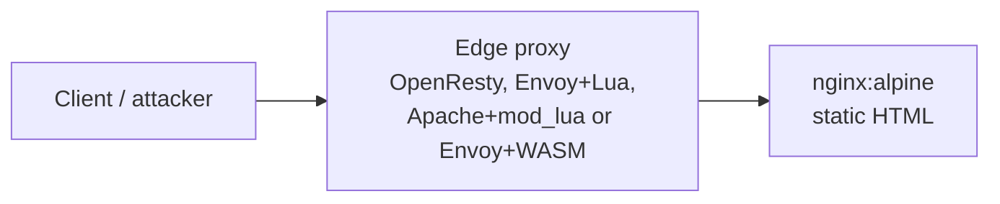

<!-- CONTEXT.md: orientation for humans and AI; explains repo purpose, stack, layout, and where to look for behavior. -->
# Project context (for AI assistants and contributors)

<!-- Intro: why this doc exists — one paragraph to align readers on WADM/honeytokens before diving into files. -->
This repository is a small **web-application-defense / honeypot-style demonstration** (“WADM” in logs). A trivial static “backend” is served through one of several **edge proxies**. Each proxy loads `config.json`, **injects HTML comment honeytokens** into HTML responses (based on path patterns), and **watches incoming traffic** for configured `trigger_keyword` strings. When a keyword appears in a query parameter (or, with `post_body_inspection` on, a POST form body on OpenResty and Envoy+Lua), the proxy logs a `WADM ALERT`, **strips** that parameter so the origin never sees the secret, and **records the client IP** (the socket peer) in an in-memory store.

The same `config.json` schema is consumed by all four edges (OpenResty, Envoy+Lua, Apache+mod_lua, Envoy+WASM), and every edge implements the **same** detection and injection mechanism — same parsing, same strip, same alert text — so their costs can be compared. The mechanism is specified in `docs/EDGE_LEVELING.md` ("Behavioural equivalence and latency pass") and checked by `benchmarks/parity_check.py`.

---

## `config.json` (what operators should know)

<!-- JSON cannot contain comments; keep field guidance here so editors stay valid. -->
| Field | Meaning for you |
|--------|------------------|
| `honeytokens.html_comments[]` | Each entry is one injectable “bait” plus optional detection string. |
| `enabled` | Per-token on/off switch (all kinds). `1`/`on`/`true` → the token is planted **and** watched; `0`/`off`/`false` → fully dormant (not injected, not detected). Absent defaults to **on**. |
| `paths` | Which page(s) to inject into: `/*` for every page, or an **exact** request path like `/admin.html` (match is against the URI without query). The homepage is `/`, not `/index.html`. List several to target multiple pages, e.g. `["/login.html", "/admin.html"]`. Available pages live in `backend/www/`. |
| `comment_value` | HTML comment string embedded before `</body>` (or appended). Treat as **secret** you want leaked only if someone scrapes HTML. |
| `trigger_keyword` | If present, every edge checks the **decoded query parameters** for this substring. A matching parameter is logged, stripped before proxying, and the client IP is recorded. Empty/absent → inject-only for that row. |

### Additional honeytoken kinds

Four further kinds live as sibling arrays under `honeytokens`, **implemented on all four edges** (OpenResty, Envoy+Lua, Envoy+WASM, Apache) with matching semantics and identical `WADM ALERT` log formats so the edges stay comparable for benchmarking. Each row's fields are admin-settable, just like `html_comments`, and every token honours the same `enabled` switch described above.

Two intentional parity notes: (1) **POST-body** inspection (keywords and form-field tamper) exists on OpenResty and Envoy+Lua only — every edge detects the query-string case, which is the only case active while `post_body_inspection` is `false` (the default); (2) each kind is timed in **its own** microsecond region, logged as `WADM TOKEN <kind> detect|inject (us): N`, added *around* the existing code rather than inside the html_comments timers — so the html_comments measurement is unchanged and every kind is separately benchmarkable. See `benchmarks/README.md` and `docs/EDGE_LEVELING.md`.

| Kind (`honeytokens.<key>[]`) | Injection | Detection | Admin properties |
|--------|-----------|-----------|------------------|
| `http_headers` | Decoy **response header** on matching `paths`. | Keyword replay of the value in a later request (path/Host/query). | `paths`, `header_name`, `header_value`, `trigger_keyword` |
| `cookies` | **Set-Cookie** bait on matching `paths`. | **Tamper**: returned cookie value ≠ planted `cookie_value`. A browser replays it unchanged, so only an attacker fires it. | `paths`, `cookie_name`, `cookie_value`, `attributes` (extra cookie attributes appended verbatim), `trigger_keyword` (optional value-replay) |
| `decoy_paths` | Advertises a fake path as a hidden HTML link on `advertise_on_paths`. | **Path match**: any request whose URI matches `trap_path` (no keyword). | `trap_path`, `match_type` (`exact`\|`prefix`), `advertise_via` (`link`\|`robots`\|`none`), `advertise_on_paths`, `link_text` |
| `form_fields` | Hidden `<input>` injected before `</form>` on matching `paths`. | **Tamper**: submitted value ≠ planted `field_value` (query always; POST only when `post_body_inspection` is on, OpenResty and Envoy+Lua). | `paths`, `field_name`, `field_value`, `trigger_keyword` (optional) |

### Fake SQL-injection trap (`sql_injection`)

A **top-level** key, not a honeytoken kind: it plants nothing, and it is a single response
policy rather than an array of baits. It makes the login endpoint look like a vulnerable LAMP
app. When a request matches `methods` + `paths`, the edge **stops proxying and answers itself** —
the origin is never asked (see the WASM exception in the parity notes below). Each watched form
field is percent-decoded, ASCII-lowercased and whitespace-collapsed, then substring-matched
against `signatures`. A hit logs a `WADM ALERT`, records the client IP, and returns
`status_code` with `error_template`; anything else returns `deny_status_code` with
`deny_template`. `{PAYLOAD}` in either template is replaced by the attacker's own (HTML-escaped,
`reflect_max_len`-capped) input.

| Field | Meaning for you |
|--------|------------------|
| `enabled` | Same on/off semantics as every other kind. Off → the endpoint proxies normally again. |
| `paths` / `methods` | What the trap owns. Kept narrow (`POST` `/api/login`) so the benchmarked `GET` population is untouched. |
| `watch_fields` | Which form fields are inspected, in priority order — first match wins. |
| `signatures` | Literal lowercase substrings. Literal (not regex) because Apache mod_lua and Envoy Lua have no PCRE and the Rust `regex` crate would bloat the wasm binary. |
| `reflect_max_len` | Cap on how much of the payload is echoed back into `{PAYLOAD}`. |
| `status_code` / `error_template` | The fake MySQL error. Leaks a plausible `SELECT` to invite `UNION SELECT` follow-ups. |
| `deny_status_code` / `deny_template` | What a clean login sees, so the endpoint looks real rather than 404ing. |

Accepted false-positive surface: `/*` and `'--` are legitimate (if odd) password characters, so a
real user could trip the trap. That is fine here — nothing but attack traffic reaches this app,
and over-triggering costs only a fake error page.

Templates must stay **single-line and free of `"` and `\`**: `envoy-wasm/entrypoint.sh` inlines
`config.json` into a YAML scalar, and while that scalar is now single-quoted (so escapes are no
longer processed), keeping the strings simple is cheap defence in depth.

Edit `config.json` on the host; Compose mounts it read-only into each edge container at the paths listed in `docker-compose.yml`.

---

## High-level architecture

<!-- Diagram + bullets: why read this first — shows traffic shape before opening compose or envoy. -->

```mermaid
flowchart LR
  Client[Client / attacker]
  Edge[Edge proxy\nOpenResty, Envoy+Lua,\nApache+mod_lua or Envoy+WASM]
  Backend[nginx:alpine\nstatic HTML]

  Client --> Edge
  Edge --> Backend
```

1. **Backend** — plain nginx serving the static pages in `backend/www/` (the “victim” application surface: `/`, `/login.html`, `/dashboard.html`, `/admin.html`, `/about.html`). It has **no** `/api/login` route; that endpoint belongs to the edge (see `sql_injection` above).
2. **Edge** (pick one compose profile) — terminates HTTP, applies WADM rules, proxies to `backend:80`.
3. **Configuration** — `config.json` at repo root lists `honeytokens.html_comments[]` with `paths`, `comment_value`, and optional `trigger_keyword`, plus the top-level `sql_injection` policy.

Docker Compose wires services on a shared `honeypot` bridge network. Only the edge service exposes a host port (`8080`, `8081`, `8082`, or `8083` depending on profile).

---

## Exact tech stack

<!-- Stack table: why it matters — pins what images and runtimes to expect when reproducing bugs. -->
| Layer | Technology | Version / image (as pinned in repo) |
|--------|------------|--------------------------------------|
| Orchestration | Docker Compose | Compose file v3-style `services` |
| Backend | nginx | `nginx:alpine` |
| OpenResty path | OpenResty (nginx + LuaJIT + `lua-nginx-module`) | `openresty/openresty:latest` |
| Envoy paths | Envoy Proxy | `envoyproxy/envoy:v1.30-latest` |
| Envoy Lua | Built-in Envoy HTTP Lua filter + vendored `json.lua` (rxi) | See `envoy_scripts/json.lua` |
| Envoy WASM | `envoy.filters.http.wasm` + **V8** runtime (`envoy.wasm.runtime.v8`) | Same Envoy image |
| WASM filter | Rust, `cdylib`, **proxy-wasm** SDK | `proxy-wasm = "0.2"`, `serde` / `serde_json`, `log`, edition 2021 |
| WASM build | Rust official image | `rust:latest`, target `wasm32-unknown-unknown` |
| Shell glue | POSIX `sh`, `sed` | `envoy-wasm/entrypoint.sh` embeds JSON into YAML |

**Host ports (defaults in `docker-compose.yml`):** OpenResty `8080`, Envoy+Lua `8081`, Envoy+WASM `8082`, Apache `8083`.

**Where requests are recorded.** The edges write **no access log** (Envoy never did; OpenResty's and Apache's were removed so no edge pays a per-request write the others don't). The per-request record is the origin's access log, whose `xff=` field carries the real client IP from every edge (Envoy runs with `use_remote_address: true` so it forwards it, as OpenResty and Apache already did). Requests the edge answers itself — the SQLi trap — never reach the origin and are recorded by the edge as `WADM ALERT` (signature hit) or `WADM TRAP` (no hit).

---

## Root-level folders and files

<!-- Map: why each top-level path exists — quick navigation for changes. -->
| Path | Role |
|------|------|
| `backend/` | Origin container: `nginx.conf` (its access log, with the client IP in `xff=`, is the per-request record for every edge) plus `www/` — the document root, mounted whole, holding the dummy app's pages. Drop any `.html` into `backend/www/` and it is served automatically. |
| `nginx/` | OpenResty — the **reference** edge: `init_by_lua` loads and precompiles the config into one `wadm` table; `access_by_lua` detects and strips; `header_filter_by_lua` / `body_filter_by_lua` inject. Uses `lua_shared_dict` for IP marking. |
| `envoy/` | Envoy static config: HTTP connection manager → **Lua** HTTP filter (`injection.lua`) → router → `backend` cluster. Mounts `config.json` and `envoy_scripts/`. |
| `envoy_scripts/` | Envoy Lua filter source (`injection.lua`), JSON helper (`json.lua`), and `download_json_lua.sh` to refresh the vendored JSON library. |
| `envoy-wasm/` | Envoy YAML template with `{{WASM_CONFIG_JSON}}` placeholder, plus `entrypoint.sh` that merges `config.json` into the WASM filter plugin configuration at container start. |
| `wasm-filter/` | Rust **proxy-wasm** HTTP filter compiled to `.wasm`; Dockerfile copies artifact to shared volume for Envoy. |
| `docs/` | Auxiliary documentation (e.g. `tree.txt` snapshot of layout). |
| `apache_scripts/` | Apache mod_lua edge: shared core `wadm.lua` plus the three hook files (`detect.lua`, `inject.lua`, `login.lua`). |
| `docker-compose.yml` | Service definitions, profiles (`openresty`, `envoy`, `wasm`, `apache`, `loadtest`), shared volume `wasm_output` between `rust-builder` and `envoy-wasm`. |
| `config.json` | Shared honeytoken definitions consumed by all edge variants. |
| `*-baseline.{conf,yaml}` | One per edge (`nginx/nginx-baseline.conf`, `envoy/envoy-baseline.yaml`, `envoy-wasm/envoy-wasm-baseline.yaml`, `httpd-baseline.conf`): the same edge with the WADM filter deleted, mounted into the **same** service via the `${OPENRESTY_CONF}` / `${ENVOY_CONF}` / `${ENVOY_WASM_CONF}` / `${HTTPD_CONF}` overrides. Supplies the no-WADM baseline the benchmark's end-to-end overhead is measured against. |

---

## Operating modes (Compose profiles)

<!-- Profiles: why — default vs edge selection affects which port and code path runs. -->
- **Default:** only `backend` runs (no published edge port).
- **`--profile openresty`:** OpenResty edge on port 8080.
- **`--profile envoy`:** Envoy + Lua on 8081.
- **`--profile wasm`:** Envoy + WASM on 8082 (entrypoint injects JSON into filter config). `rust-builder` copies `filter.wasm` from its image; add `--build` after editing `wasm-filter/`, or Compose reuses the previously built image.
- **`--profile apache`:** Apache + mod_lua on 8083. Scripts are cached for the container's lifetime (`LuaCodeCache forever`), so restart it after editing them.

---

## Most complex subsystems (deep dives)

<!-- Pointers: why — delegates detail to module READMEs without duplicating long flows. -->
For internal data flow and phase-by-phase behavior, read the short READMEs in:

1. `wasm-filter/README.md` — Rust proxy-wasm filter (headers/body buffering, injection, path cleaning).
2. `envoy_scripts/README.md` — Envoy Lua filter (`injection.lua`): request and response phases, dynamic-metadata path hand-off.
3. `nginx/README.md` — OpenResty multi-phase Lua pipeline and chunked body assembly.
4. `apache_scripts/README.md` — Apache mod_lua hooks, the shared `wadm.lua` core, and the parity reference table.

These four contain the bulk of domain logic; `envoy/` and `envoy-wasm/` are mostly declarative Envoy YAML plus the WASM bootstrap script.
