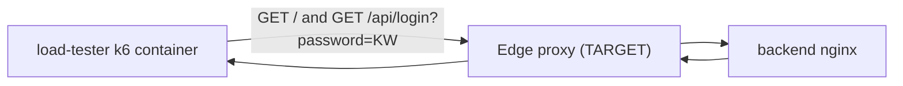

<!-- benchmarks/README.md: external k6 load generator for WADM edge benchmarking; lives outside any edge profile so it never auto-runs with a normal `up`. -->
# benchmarks (k6 load generator)

External request-latency probe for the WADM edge proxies. A `grafana/k6` container joins the `honeypot` Docker network and hits whichever edge is selected via the `TARGET` env var, recording per-phase latency for the two WADM behaviours that matter:

| Phase | Request | k6 Trend metric |
|-------|---------|-----------------|
| HTML injection (response rewrite) | `GET ${TARGET}/` | `inject_get_duration` |
| Detection + stripping (request scrub) | `GET ${TARGET}/api/login?password=${TRIGGER_KEYWORD}` | `detect_query_duration` |

The two custom `Trend`s are reported separately in k6's end-of-run summary; the built-in `http_req_duration` mixes both calls and is less useful for per-phase analysis.

## Why the keyword is in the query string

All four edges already inspect the request **query string** (OpenResty `get_uri_args`, Envoy+Lua `parse_query_string`, Apache `r.args`, WASM `:path` substring). Putting `TRIGGER_KEYWORD` in `?password=...` therefore exercises the detection path on every edge, so `detect_query_duration` is comparable across all four.

POST-body inspection still exists in OpenResty (`nginx/nginx.conf`) and Envoy+Lua (`envoy_scripts/injection.lua`); it is intentionally left in place for a follow-up iteration that raises Apache and Envoy+WASM to the same level (by implementing body inspection in `apache_scripts/detect.lua` and `wasm-filter/src/lib.rs`) and re-introduces a `detect_body_duration` scenario alongside this one.

## Data flow



The load-tester runs in-network, so it resolves edges by Compose service name. No host-port hop, no Docker NAT — measurements reflect proxy + backend cost, not the host networking stack.

## Running

The service is gated behind the `loadtest` profile and never starts with a plain edge `up`. Combine `loadtest` with whichever edge profile you want to benchmark, and override `TARGET` to match that edge's in-network address (each listens on a different container port):

```bash
# OpenResty edge (in-network port 80)
docker compose --profile openresty --profile loadtest up --abort-on-container-exit

# Envoy + Lua edge (in-network port 8080)
TARGET=http://envoy:8080 \
  docker compose --profile envoy --profile loadtest up --abort-on-container-exit

# Envoy + WASM edge (in-network port 8080, service name envoy-wasm)
TARGET=http://envoy-wasm:8080 \
  docker compose --profile wasm --profile loadtest up --abort-on-container-exit

# Apache + mod_lua edge (in-network port 80)
TARGET=http://apache:80 \
  docker compose --profile apache --profile loadtest up --abort-on-container-exit
```

`--abort-on-container-exit` stops the edge once k6 finishes its run so you don't have to `down` manually.

### Tunables

All passed through environment variables on the host (read by Compose, then forwarded into the container):

| Var | Default | Effect |
|-----|---------|--------|
| `TARGET` | `http://openresty:80` | Base URL the script hits. Must be an in-network address. |
| `TRIGGER_KEYWORD` | `internal-admin.example.com` | Substring placed in the query string to fire the detection phase. Should match a `trigger_keyword` in `config.json`. |
| `K6_VUS` | `5` | Concurrent virtual users. |
| `K6_DURATION` | `30s` | Run length. |

## Internal OpenResty profiling automation

Use the orchestrator to benchmark **internal** Lua execution timings logged by OpenResty:
- `Detection execution time (us): ...`
- `Injection execution time (us): ...`

The script runs four VU levels (`1,10,100,500`) sequentially and prints per-VU stats for each phase (`count, min_us, avg_us, p90_us, max_us`).

```bash
python3 benchmarks/run_internal_openresty_benchmark.py
```

Optional overrides:

```bash
K6_VUS_LIST=1,10,100,500 \
K6_DURATION=30s \
K6_START_DELAY=5s \
TARGET=http://openresty:80 \
TRIGGER_KEYWORD=internal-admin.example.com \
python3 benchmarks/run_internal_openresty_benchmark.py
```

Result artifact:
- `benchmarks/results/internal_openresty_profile.json`

If Docker is unavailable, the script exits after reporting the failed compose command output; no benchmark stats are produced for that VU.

## Internal Envoy Lua profiling automation

Use the orchestrator to benchmark **internal** Lua execution timings logged by the Envoy Lua filter (`envoy_scripts/injection.lua`):
- `Envoy Lua Detection execution time (us): ...`
- `Envoy Lua Injection execution time (us): ...`

The script runs four VU levels (`1,10,100,500`) sequentially and prints per-VU stats for each phase (`count, min_us, avg_us, p90_us, max_us`). The `envoy` container stays up between VU levels — only the `load-tester` is cycled — so Envoy is not cold-started for each level.

```bash
python3 benchmarks/run_internal_envoy_lua_benchmark.py
```

Optional overrides:

```bash
K6_VUS_LIST=1,10,100,500 \
K6_DURATION=30s \
K6_START_DELAY=5s \
TARGET=http://envoy:8080 \
TRIGGER_KEYWORD=internal-admin.example.com \
python3 benchmarks/run_internal_envoy_lua_benchmark.py
```

Result artifact:
- `benchmarks/results/internal_envoy_lua_profile.json`

## Internal WASM profiling automation

Use the orchestrator to benchmark **internal** Rust WASM execution timings logged by `envoy-wasm`:
- `WASM Detection execution time (us): ...`
- `WASM Injection execution time (us): ...`

The script runs four VU levels (`1,10,100,500`) sequentially and prints per-VU stats for each phase (`count, min_us, avg_us, p90_us, max_us`).

```bash
python3 benchmarks/run_internal_wasm_benchmark.py
```

Optional overrides:

```bash
K6_VUS_LIST=1,10,100,500 \
K6_DURATION=30s \
K6_START_DELAY=5s \
TARGET=http://envoy-wasm:8080 \
TRIGGER_KEYWORD=internal-admin.example.com \
python3 benchmarks/run_internal_wasm_benchmark.py
```

Result artifact:
- `benchmarks/results/internal_wasm_profile.json`

Compose profile `wasm` rebuilds the filter via `rust-builder` before starting `envoy-wasm`, so each run picks up the latest `wasm-filter` sources.

## Cross-edge comparability

`detect_query_duration` measures the cost of `GET /api/login?password=<KW>` — a surface every edge already inspects, so the numbers are directly comparable:

| Edge | Inspects query string? | What `detect_query_duration` measures |
|------|------------------------|---------------------------------------|
| OpenResty (`nginx/nginx.conf`) | Yes (`ngx.req.get_uri_args`) | Detection + stripping cost. |
| Envoy + Lua (`envoy_scripts/injection.lua`) | Yes (`parse_query_string`) | Detection + stripping cost. |
| Apache + mod_lua (`apache_scripts/detect.lua`) | Yes (`r.args`) | Detection + stripping cost. |
| Envoy + WASM (`wasm-filter/src/lib.rs`) | Yes (`:path` substring search) | Detection + stripping cost. |

## Files

| File | Role |
|------|------|
| [test.js](test.js) | The k6 default-function script with the two phase requests and `Trend` definitions. |
| [run_internal_openresty_benchmark.py](run_internal_openresty_benchmark.py) | Orchestrates internal OpenResty microsecond profiling runs and writes JSON results. |
| [run_internal_envoy_lua_benchmark.py](run_internal_envoy_lua_benchmark.py) | Orchestrates internal Envoy Lua microsecond profiling runs and writes JSON results. |
| [run_internal_wasm_benchmark.py](run_internal_wasm_benchmark.py) | Orchestrates internal Envoy WASM microsecond profiling runs and writes JSON results. |
| [README.md](README.md) | This document. |
