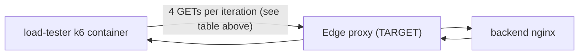

<!-- benchmarks/README.md: external k6 load generator for WADM edge benchmarking; lives outside any edge profile so it never auto-runs with a normal `up`. -->
# benchmarks (k6 load generator)

External request-latency probe for the WADM edge proxies. A `grafana/k6` container joins the `honeypot` Docker network and hits whichever edge is selected via the `TARGET` env var. One iteration issues four `GET`s, chosen so that **every honeytoken kind has both its injection and its detection path exercised**:

| Request | k6 Trend metric | Detection fired | Injection fired |
|---------|-----------------|-----------------|-----------------|
| `GET ${TARGET}/` | `inject_get_duration` | — | html_comments, http_headers, cookies, decoy_paths |
| `GET ${TARGET}/api/login?password=${TRIGGER_KEYWORD}` | `detect_query_duration` | html_comments | html_comments, http_headers, cookies, decoy_paths |
| `GET ${TARGET}${FORM_PAGE}?${FORM_FIELD}=1&probe=${HEADER_KEYWORD}` with a tampered `Cookie` | `token_tamper_duration` | form_fields, http_headers, cookies | all five kinds |
| `GET ${TARGET}${DECOY_PATH}` | `token_decoy_duration` | decoy_paths | html_comments, http_headers, cookies, decoy_paths |

The custom `Trend`s are reported separately in k6's end-of-run summary; the built-in `http_req_duration` mixes all four calls and is less useful for per-phase analysis. Note these Trends measure *end-to-end request latency*; the per-phase, per-kind microsecond numbers that the thesis plots use come from the edges' own internal timers (see below).

The third request deliberately bundles three kinds: each edge times each kind in its own region, so bundling costs nothing in attribution while keeping the iteration short.

## Why the keyword is in the query string

All four edges already inspect the request **query string** (OpenResty `get_uri_args`, Envoy+Lua `parse_query_string`, Apache `r.args`, WASM `:path` substring). Putting `TRIGGER_KEYWORD` in `?password=...` therefore exercises the detection path on every edge, so `detect_query_duration` is comparable across all four. The same reasoning drives the `form_fields` and `http_headers` surfaces in request 3 — both are query-string checks on every edge.

POST-body inspection still exists in OpenResty (`nginx/nginx.conf`) and Envoy+Lua (`envoy_scripts/injection.lua`); it is intentionally left in place for a follow-up iteration that raises Apache and Envoy+WASM to the same level (by implementing body inspection in `apache_scripts/detect.lua` and `wasm-filter/src/lib.rs`) and re-introduces a `detect_body_duration` scenario alongside this one.

## Data flow


```mermaid
flowchart LR
  k6[load-tester k6 container]
  Edge["Edge proxy (TARGET)"]
  Backend[backend nginx]

  k6 -->|"4 GETs per iteration (see table above)"| Edge
  Edge --> Backend
  Backend --> Edge
  Edge --> k6
```

The load-tester runs in-network, so it resolves edges by Compose service name. No host-port hop, no Docker NAT — measurements reflect proxy + backend cost, not the host networking stack.

## Running

The service is gated behind the `loadtest` profile and never starts with a plain edge `up`. Combine `loadtest` with whichever edge profile you want to benchmark, and override `TARGET` to match that edge's in-network address (each listens on a different container port):

```bash
# OpenResty edge (in-network port 80)
docker compose --profile openresty --profile loadtest up --abort-on-container-exit

# Envoy + Lua edge (in-network port 8080)
TARGET=http://envoy:8080 \
  docker compose --profile envoy --profile loadtest up --abort-on-container-exit

# Envoy + WASM edge (in-network port 8080, service name envoy-wasm)
TARGET=http://envoy-wasm:8080 \
  docker compose --profile wasm --profile loadtest up --abort-on-container-exit

# Apache + mod_lua edge (in-network port 80)
TARGET=http://apache:80 \
  docker compose --profile apache --profile loadtest up --abort-on-container-exit
```

`--abort-on-container-exit` stops the edge once k6 finishes its run so you don't have to `down` manually.

### Tunables

All passed through environment variables on the host (read by Compose, then forwarded into the container):

| Var | Default | Effect |
|-----|---------|--------|
| `TARGET` | `http://openresty:80` | Base URL the script hits. Must be an in-network address. |
| `TRIGGER_KEYWORD` | `internal-admin.example.com` | Substring placed in the query string to fire the html_comments detection phase. Should match a `trigger_keyword` in `config.json`. |
| `HEADER_KEYWORD` | `app-07.internal.example.com` | Planted `http_headers` value, replayed in the query to fire that kind's detection. |
| `COOKIE_NAME` / `COOKIE_TAMPER_VALUE` | `admin_ui` / `1` | Bait cookie sent back with a value that differs from the planted `cookie_value`, firing the tamper check. |
| `DECOY_PATH` | `/api/v1/debug` | Trap URI requested to fire `decoy_paths` detection. |
| `FORM_PAGE` / `FORM_FIELD` / `FORM_TAMPER_VALUE` | `/login.html` / `is_admin` / `1` | Page carrying the hidden input (it must contain a `</form>`) and the tampered value submitted in the query string. |
| `K6_VUS` | `5` | Concurrent virtual users. |
| `K6_DURATION` | `30s` | Run length. |

All the honeytoken defaults mirror `config.json`; override them if the token definitions change.

## Internal OpenResty profiling automation

Use the orchestrator to benchmark **internal** Lua execution timings logged by OpenResty:
- `Detection execution time (us): ...`
- `Injection execution time (us): ...`

The script runs four VU levels (`1,10,100,500`) sequentially and prints per-VU stats for each phase (`count, min_us, avg_us, p90_us, max_us`).

```bash
python3 benchmarks/run_internal_openresty_benchmark.py
```

Optional overrides:

```bash
K6_VUS_LIST=1,10,100,500 \
K6_DURATION=30s \
K6_START_DELAY=5s \
TARGET=http://openresty:80 \
TRIGGER_KEYWORD=internal-admin.example.com \
python3 benchmarks/run_internal_openresty_benchmark.py
```

Result artifacts:
- `benchmarks/results/internal_openresty_profile.json` — per-VU summary stats.
- `benchmarks/results/internal_openresty_raw.json` — raw per-request latencies (see [Raw sample files](#raw-sample-files)).

The `openresty` container stays up between VU levels — only the `load-tester` is cycled, and each VU level's logs are isolated with `docker compose logs --since` — so OpenResty/LuaJIT is not cold-started for each level and every VU level produces distinct measurements.

If Docker is unavailable, the script exits after reporting the failed compose command output; no benchmark stats are produced for that VU.

## Internal Envoy Lua profiling automation

Use the orchestrator to benchmark **internal** Lua execution timings logged by the Envoy Lua filter (`envoy_scripts/injection.lua`):
- `Envoy Lua Detection execution time (us): ...`
- `Envoy Lua Injection execution time (us): ...`

The script runs four VU levels (`1,10,100,500`) sequentially and prints per-VU stats for each phase (`count, min_us, avg_us, p90_us, max_us`). The `envoy` container stays up between VU levels — only the `load-tester` is cycled — so Envoy is not cold-started for each level.

```bash
python3 benchmarks/run_internal_envoy_lua_benchmark.py
```

Optional overrides:

```bash
K6_VUS_LIST=1,10,100,500 \
K6_DURATION=30s \
K6_START_DELAY=5s \
TARGET=http://envoy:8080 \
TRIGGER_KEYWORD=internal-admin.example.com \
python3 benchmarks/run_internal_envoy_lua_benchmark.py
```

Result artifacts:
- `benchmarks/results/internal_envoy_lua_profile.json` — per-VU summary stats.
- `benchmarks/results/internal_envoy_lua_raw.json` — raw per-request latencies (see [Raw sample files](#raw-sample-files)).

## Internal Apache mod_lua profiling automation

Use the orchestrator to benchmark **internal** Lua execution timings logged by the Apache `mod_lua` handler (`apache_scripts/detect.lua`):
- `Apache Detection execution time (us): ...`
- `Apache Injection execution time (us): ...`

The script runs four VU levels (`1,10,100,500`) sequentially and prints per-VU stats for each phase (`count, min_us, avg_us, p90_us, max_us`). The `apache` container stays up between VU levels — only the `load-tester` is cycled — so Apache is not cold-started for each level.

```bash
python3 benchmarks/run_internal_apache_lua_benchmark.py
```

Optional overrides:

```bash
K6_VUS_LIST=1,10,100,500 \
K6_DURATION=30s \
K6_START_DELAY=5s \
TARGET=http://apache:80 \
TRIGGER_KEYWORD=internal-admin.example.com \
python3 benchmarks/run_internal_apache_lua_benchmark.py
```

Result artifacts:
- `benchmarks/results/internal_apache_lua_profile.json` — per-VU summary stats.
- `benchmarks/results/internal_apache_lua_raw.json` — raw per-request latencies (see [Raw sample files](#raw-sample-files)).

## Internal WASM profiling automation

Use the orchestrator to benchmark **internal** Rust WASM execution timings logged by `envoy-wasm`:
- `WASM Detection execution time (us): ...`
- `WASM Injection execution time (us): ...`

The script runs four VU levels (`1,10,100,500`) sequentially and prints per-VU stats for each phase (`count, min_us, avg_us, p90_us, max_us`).

```bash
python3 benchmarks/run_internal_wasm_benchmark.py
```

Optional overrides:

```bash
K6_VUS_LIST=1,10,100,500 \
K6_DURATION=30s \
K6_START_DELAY=5s \
TARGET=http://envoy-wasm:8080 \
TRIGGER_KEYWORD=internal-admin.example.com \
python3 benchmarks/run_internal_wasm_benchmark.py
```

Result artifacts:
- `benchmarks/results/internal_wasm_profile.json` — per-VU summary stats.
- `benchmarks/results/internal_wasm_raw.json` — raw per-request latencies (see [Raw sample files](#raw-sample-files)).

Compose profile `wasm` rebuilds the filter via `rust-builder` before starting `envoy-wasm`, so each run picks up the latest `wasm-filter` sources.

## Raw sample files

Each internal benchmark writes two artifacts per edge:

| File | Contents |
|------|----------|
| `internal_<edge>_profile.json` | Per-VU **summary** stats (`count, min_us, avg_us, p90_us, max_us`) for each phase, plus a `tokens` section with the same stats per honeytoken kind and a `throughput` section recording achieved vs. achievable iterations. Small, human-readable. |
| `internal_<edge>_raw.json` | Per-VU **raw** per-request latency arrays: `runs[].detection_us[]`, `runs[].injection_us[]`, and the same samples split per kind under `runs[].tokens`. All in microseconds. |

The raw file exists so that box plots can be drawn from the true latency distribution (real quartiles), which the summary stats alone cannot reconstruct. Shape:

```json
{
  "metadata": { "...": "same as the profile file, plus a note field" },
  "runs": [
    {
      "vus": 1,
      "detection_us": [97, 41, ...],
      "injection_us": [26, 8, ...],
      "tokens": {
        "html_comments": { "detect_us": [97, 41, ...], "inject_us": [26, 8, ...] },
        "http_headers":  { "detect_us": [...], "inject_us": [...] },
        "cookies":       { "detect_us": [...], "inject_us": [...] },
        "decoy_paths":   { "detect_us": [...], "inject_us": [...] },
        "form_fields":   { "detect_us": [...], "inject_us": [...] }
      }
    }
  ]
}
```

`tokens.html_comments` repeats `detection_us` / `injection_us` verbatim, so every kind can be queried through one uniform path while the top-level keys stay where the older plots expect them.

## Per-honeytoken-kind timing

Every edge times each honeytoken kind in its own microsecond region and logs:

```
WADM TOKEN <kind> detect (us): N
WADM TOKEN <kind> inject (us): N
```

for `kind` in `http_headers | cookies | decoy_paths | form_fields`. `html_comments` keeps its original `Detection/Injection execution time (us)` lines and is folded into the same `tokens` structure by the orchestrators.

The lowercase `detect` / `inject` words are deliberate: they share no substring with either html_comments scraper pattern, so OpenResty's **unprefixed** `Detection execution time \(us\):` regex cannot match a per-kind line and silently corrupt `detection_us`.

What each timer wraps, and why the html_comments numbers are unaffected, is documented in [EDGE_LEVELING.md](../docs/EDGE_LEVELING.md#additional-honeytoken-kinds-get-their-own-timed-regions). In short: per-request setup (client IP, URI, parsed query, `Cookie`) is read once outside every timer; a `detect` timer wraps that kind's scan + in-memory IP record and fires only on a hit, with alert rendering and the log write happening *after* it closes; an `inject` timer wraps the header write or the anchor-locate-and-splice, with token selection and markup construction hoisted out.

Because an iteration now carries four requests rather than two, absolute html_comments numbers are **not** comparable with runs recorded before this change. All four edges are re-measured together, so the cross-edge comparison remains valid.

## Box-plot comparison across edges

`plot_edge_comparison.py` renders one figure per VU level, placing all four edges side by side with a detection subplot and an injection subplot. Every honeytoken kind — `html_comments`, `http_headers`, `cookies`, `decoy_paths`, `form_fields` — is **pooled into one distribution per edge**, so the figure answers "which edge is cheapest at honeytoken work overall". For the per-kind breakdown behind those numbers, use `plot_token_comparison.py` below.

Pooling is by concatenation of raw samples, so each kind contributes in proportion to how often it actually fires within an iteration (the `/*` kinds inject on all four benchmark requests, `form_fields` on one). A box therefore reads as "what a honeytoken operation costs on this edge", not as a mean of per-kind means.

The `sql_injection` trap is excluded from both figures: it plants no token, is a single response policy rather than a honeytoken kind, and logs under its own non-colliding label.

```bash
# defaults to benchmarks/results/, writes PNGs to benchmarks/results/plots/
python3 benchmarks/plot_edge_comparison.py

# or point it at a different results directory
python3 benchmarks/plot_edge_comparison.py path/to/results
```

For each edge it prefers `internal_<edge>_raw.json` and draws a **true box plot** (box = Q1–Q3, line = median, whiskers = 1.5×IQR). If an edge's raw file is missing, it falls back to a **count-weighted summary approximation** from the profile file (box = min→p90, line = mean, whisker = max) and marks that box with a hatched/faded style so it is not mistaken for real quartile data. Re-run that edge's benchmark to replace the fallback with a real box.

Result files written before per-kind timing existed carry only the top-level html_comments arrays; those are mapped onto the `html_comments` kind, so an old file still renders (as that one kind) rather than vanishing from the figure.

Output artifacts:
- `benchmarks/results/plots/edge_comparison_vus_<N>.png` (one per VU level).

## Per-honeytoken-kind plots

`plot_token_comparison.py` breaks the same samples down per kind: every honeytoken kind, both phases, all four edges. Use `plot_edge_comparison.py` to rank edges, this one to see which kind drives the cost.

```bash
# defaults to benchmarks/results/, writes PNGs to benchmarks/results/plots/
python3 benchmarks/plot_token_comparison.py

# or point it at a different results directory
python3 benchmarks/plot_token_comparison.py path/to/results
```

Output artifacts:

| File | Layout |
|------|--------|
| `token_comparison_vus_<N>.png` (one per VU level) | 2 rows (detection, injection) × 5 columns (one per kind); four edge box plots per panel, log-scale y shared across each row so kinds are comparable within a phase. |
| `token_scaling_detect.png`, `token_scaling_inject.png` | Median latency vs. VU level, one panel per kind, one direct-labelled line per edge with a Q1–Q3 band — shows how each kind scales with load. |

Both scripts share [plot_common.py](plot_common.py) — the palette, the raw-preferred / summary-fallback rule (hatched, faded boxes mark an approximation), the symlog convention and the result-file loader all live there, so an edge keeps one colour and one visual language across every figure.

### Why symlog rather than log

The edges time in whole microseconds, and 8–13% of samples on OpenResty, WASM and Envoy+Lua land on exactly **0 µs** — the work finished inside one timer tick. A pure log axis cannot render 0 and would silently drop that mass. Every figure therefore uses a symlog y-axis: linear below 1 µs, logarithmic above.

## Cross-edge comparability

`detect_query_duration` measures the cost of `GET /api/login?password=<KW>` — a surface every edge already inspects, so the numbers are directly comparable:

| Edge | Inspects query string? | What `detect_query_duration` measures |
|------|------------------------|---------------------------------------|
| OpenResty (`nginx/nginx.conf`) | Yes (`ngx.req.get_uri_args`) | Detection + stripping cost. |
| Envoy + Lua (`envoy_scripts/injection.lua`) | Yes (`parse_query_string`) | Detection + stripping cost. |
| Apache + mod_lua (`apache_scripts/detect.lua`) | Yes (`r.args`) | Detection + stripping cost. |
| Envoy + WASM (`wasm-filter/src/lib.rs`) | Yes (`:path` substring search) | Detection + stripping cost. |

### Level-playing-field invariants

To keep the four edges directly comparable, the internal benchmarks enforce these
guarantees (all four edges obey them):

1. **Wall-clock microseconds.** Every edge times with an elapsed wall-clock µs
   source — OpenResty `gettimeofday` (FFI), Apache `r:clock()`, Envoy+Lua
   `gettimeofday` (FFI, matching OpenResty), WASM `get_current_time()`. Envoy+Lua
   previously used `os.clock()` (process CPU time) and was **not** comparable.
2. **Detection is timed only for trigger-bearing requests.** Each edge logs
   "Detection execution time (us)" only when a trigger keyword actually matched,
   so all four sample the same population (the `?password=<KW>` request), not the
   cheap no-keyword `GET /`. Expect `detection_us` count ≈ iterations. The same
   rule holds per kind: a `WADM TOKEN <kind> detect (us)` line is emitted only when
   that kind fired, so each kind's distribution is a hit-only population on every
   edge.
3. **Warm start, quiet host, validated throughput.** Each orchestrator runs one
   throwaway warm-up burst (`WARMUP_VUS=100`, `WARMUP_DURATION=20s`) before the
   recorded levels and discards it, so JIT/caches are hot and VU=1 is not a
   cold-start outlier. The edge stack persists across levels, so warming once suffices.

   Two guards protect against host noise, both learned the hard way on this repo's
   2-core machine:

   - **Cool-down between edges** (`wait_for_quiet_host`). The 500-VU level saturates
     the host and the load takes time to decay, so running edges back-to-back measured
     whichever edge came later against a busy machine — in one run Envoy started at load
     5.5 and its VU=1 detection averaged 1636 µs against 2 µs once idle. Each orchestrator
     now waits for the 1-minute load average to fall below 2.0 before it starts.
   - **Throughput validation** (`throughput_check`). `sleep(1)` in `test.js` caps a VU at
     one iteration per second, so at VU ≤ 100 a healthy edge lands within a few percent of
     `vus × seconds`. Each level records `throughput.throughput_ratio` and prints a
     `WARNING: host was busy, treat this level as invalid` when a reachable level falls
     below 90%. Without it, a contaminated run produced 47% of the achievable iterations
     while its per-operation latencies still looked plausible. At VU=500 the edge itself
     saturates, so `expected_reachable` is false there and the ratio is a capability
     measure — compare edges to each other, not to 1.0.

   A run is only valid if every edge reports ≥90% at VU 1/10/100. The committed results
   are 94–100% across the board.
4. **Equal work: query-string scan only.** POST request-body inspection is gated
   behind the `post_body_inspection` flag in `config.json` (default `false`), so
   OpenResty and Envoy+Lua do the same detection work as Apache and WASM. The
   body-scan code is kept in place for a future iteration that enables it on all
   four edges at once (set the flag `true` and implement it in Apache + WASM).
   The `sql_injection` trap does read POST bodies, but only on `POST /api/login`,
   and `test.js` is `http.get`-only — so it never touches the measured population.
   It logs under `WADM SQLI trap build (us):`, which deliberately shares no substring
   with either scraper regex. Note the OpenResty pattern is *unprefixed*
   (`Detection execution time \(us\):`), so any prefixed variant of those words —
   e.g. `SQLi Detection execution time (us):` — would have been matched by it and
   silently corrupted `detection_us`. See `docs/EDGE_LEVELING.md`.
5. **Equal timed region: in-memory state, no disk I/O.** Every edge records the
   attacker IP into an *in-memory* store on a hit, inside the timed region, mirroring
   OpenResty's `ngx.shared.wadm_state` (`wadm:set`): Envoy+Lua and Apache use a
   module-scope Lua table, WASM uses an `Rc<RefCell<HashSet<String>>>` shared from the
   root context. No edge does filesystem I/O or JSON (de)serialisation inside the
   detection timer, and per-request setup (trigger-table build, client-IP read,
   known-attacker lookup) is hoisted *out* of the timer on all four. Envoy+Lua
   previously read and rewrote `/tmp/detected_ips.json` on the hot path (plus a
   per-request trigger-table rebuild) inside its timer, which inflated its detection
   numbers by 3–6× and was **not** comparable.
6. **Canonical injection contract: buffered whole body, single first-match splice.**
   All four edges perform the *same* HTML injection and time the *same* region:
   - **Setup outside the timer:** the `text/html` content-type guard, path matching /
     token selection, and the comment join all run *before* the injection timer starts.
   - **Whole body buffered before the timer:** OpenResty times only its final
     `body_filter` chunk (earlier chunks are accumulated untimed); WASM `Pause`s per
     chunk until `end_of_stream`; Envoy+Lua forces `:body()` buffering *before* the
     timer so the upstream body-arrival wait is excluded; Apache buffers every brigade
     chunk before transforming.
   - **Timed region (identical on all four):** assemble the full body → locate the
     first `</body>` → splice the joined comment(s) before it (append if absent) →
     write the body back. Content-Length is adjusted *outside* the timer.

   Two edges were previously non-comparable on injection: Envoy+Lua started its timer
   *before* `:body()`, charging the body-arrival/buffering wait to injection (≈5–10×
   inflation — it drops to single-digit µs once the wait is excluded); Apache ran a
   *per-chunk* `gsub` with **no path matching** (a different, cheaper unit that also
   logged one timing line per chunk instead of one per response). The one residual,
   *intended* difference is each runtime's native string primitive (OpenResty PCRE
   `ngx.re.sub`, WASM `str::find`, Envoy+Lua/Apache Lua `gsub` with count 1) — all
   produce the same first-match splice, so the leftover time is the runtime's body-API
   cost, which is exactly what the injection subplot is meant to measure.

   **Correction:** the splice primitive was *not* a fair intended difference. Envoy+Lua and
   Apache used `string.gsub`, which runs Lua's backtracking pattern matcher for what is a
   fixed-string insert — strictly more work than the job needs, and 2–3× slower than the
   other two edges on body splices while being competitive on header writes. Both now use a
   `splice_before` helper (plain `find` + two `sub`s) mirroring the WASM filter, which cut
   Envoy+Lua's body splice from 5 µs to 1 µs and Apache's from 6 µs to 3 µs, with
   byte-identical output. OpenResty still uses `ngx.re.sub` (PCRE-JIT). See
   [EDGE_LEVELING.md](../docs/EDGE_LEVELING.md#the-splice-primitive-was-not-a-fair-intended-difference).
7. **Per-kind contract: same setup hoisting, same fixed order.** The four additional
   honeytoken kinds follow the same rules as html_comments. Per-request setup (client
   IP, URI, parsed query args, `Cookie` header) is read **once** outside every timer
   and shared by all kinds; a `detect` timer wraps only that kind's scan, its alert
   log and the in-memory IP record; an `inject` timer wraps only the header write or
   the anchor-locate-and-splice, with token selection and markup construction hoisted
   out. Kinds are always walked in the fixed order
   `http_headers → cookies → decoy_paths → form_fields` (OpenResty previously used
   `pairs()`, whose order is unspecified). The body-kind timers exclude the write-back
   because the extra payloads chain on an in-memory string that is written once at the
   end — so no edge charges its body-API write to a per-kind number.

8. **No log I/O inside any timer.** Detectors record hits as small descriptors; both
   the alert *rendering* and the `WADM ALERT` *write* happen after the timer closes.
   Every edge does this, for the additional kinds and for html_comments alike.

   This was not the original design, and the reason for the change is worth recording.
   With the write inside the timer, a kind's measured cost tracked **whether it was the
   first to log on that request**, not how much scanning it did: at 100 VUs the three
   kinds that log first on their request (html_comments, http_headers, decoy_paths) came
   out at 8–47 µs while the two that log behind another kind (cookies, form_fields) came
   out at 1–8 µs — a 3–10× split, reproduced independently on all four edges, even though
   `cookies` does *more* string work than `http_headers`. The injection timers, which
   never contained a write, showed no such split. The detection figure was therefore
   ranking each runtime's logging path rather than its detection logic. Moving the I/O
   out makes detection measure detection; the alert wire format is unchanged.

## Files

| File | Role |
|------|------|
| [test.js](test.js) | The k6 default-function script: four `GET`s per iteration covering every honeytoken kind's injection and detection paths, plus the `Trend` definitions. |
| [run_internal_openresty_benchmark.py](run_internal_openresty_benchmark.py) | Orchestrates internal OpenResty microsecond profiling runs and writes summary + raw JSON results. |
| [run_internal_envoy_lua_benchmark.py](run_internal_envoy_lua_benchmark.py) | Orchestrates internal Envoy Lua microsecond profiling runs and writes summary + raw JSON results. |
| [run_internal_apache_lua_benchmark.py](run_internal_apache_lua_benchmark.py) | Orchestrates internal Apache mod_lua microsecond profiling runs and writes summary + raw JSON results. |
| [run_internal_wasm_benchmark.py](run_internal_wasm_benchmark.py) | Orchestrates internal Envoy WASM microsecond profiling runs and writes summary + raw JSON results. |
| [wadm_timings.py](wadm_timings.py) | Shared summary-statistics helpers and the cross-edge `WADM TOKEN <kind> <phase> (us):` scraper used by all four orchestrators. |
| [plot_common.py](plot_common.py) | Shared by both plotters: edge palette, result-file loader, raw/summary fallback, pooled-sample helpers, symlog axis styling. |
| [plot_edge_comparison.py](plot_edge_comparison.py) | Per-VU box-plot comparison of all four edges with **all honeytoken kinds pooled** — the edge-level ranking. |
| [plot_token_comparison.py](plot_token_comparison.py) | Per-honeytoken-kind breakdown: box plots per (phase, kind) at each VU level, plus median-vs-load scaling panels. |
| [EDGE_LEVELING.md](EDGE_LEVELING.md) | Record of the source changes that made the four edges comparable (detection state store, canonical injection contract, Envoy path capture). |
| [README.md](README.md) | This document. |
